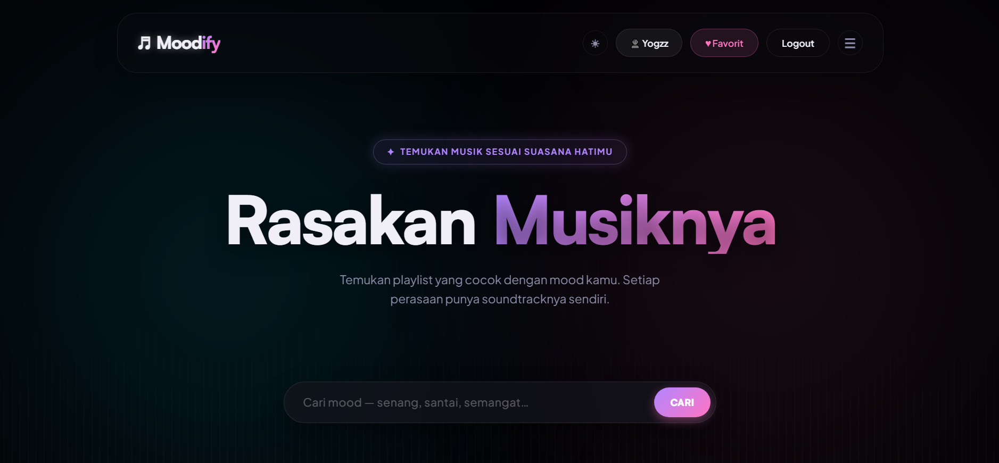
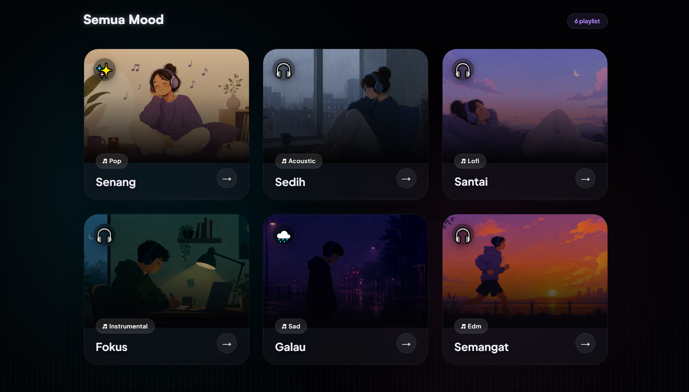
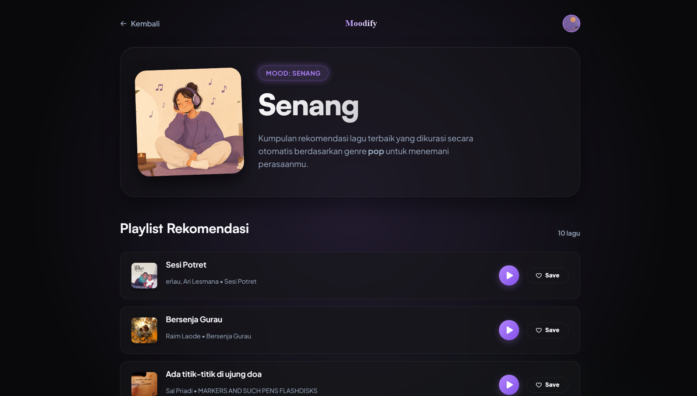
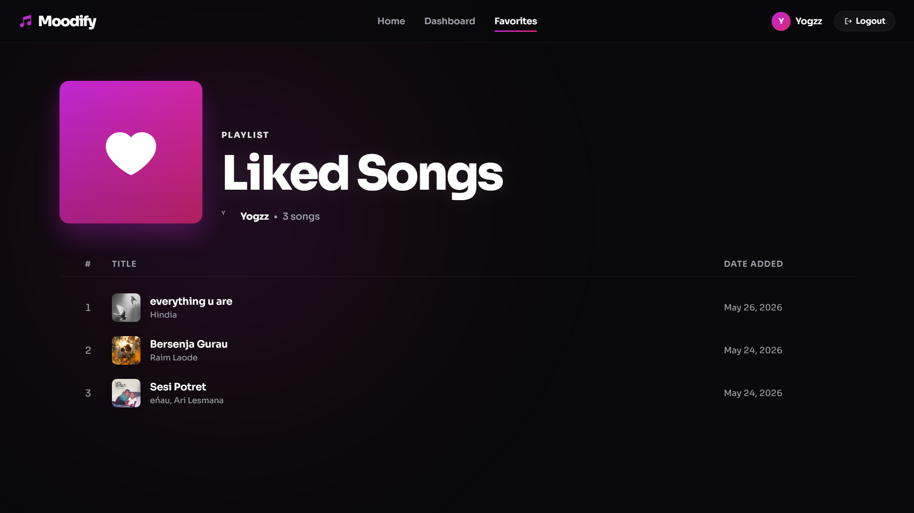
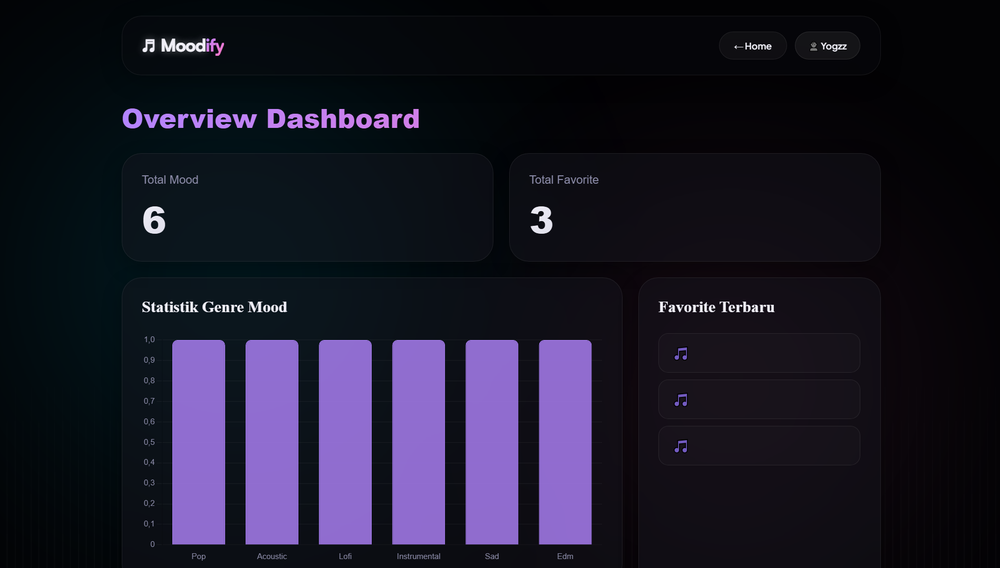
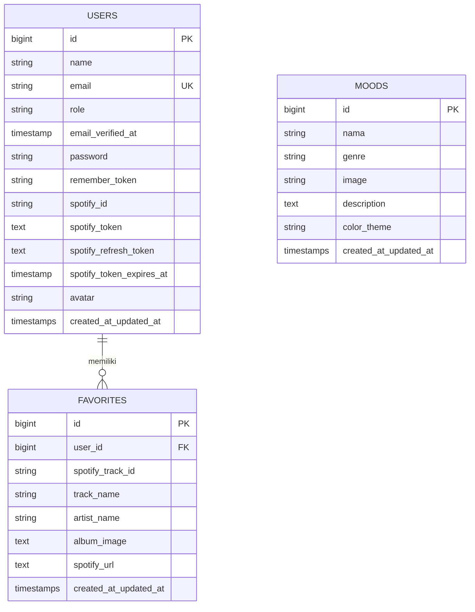

# ♬ Moodify

Moodify adalah website rekomendasi musik berbasis mood yang dibuat menggunakan Laravel dan Spotify API.
User dapat memilih suasana hati seperti senang, galau, santai, fokus, dan mendapatkan rekomendasi lagu yang sesuai.

---

# ✨ Features

* 🎵 Mood-based music recommendation
* 🔐 Login with Spotify
* ❤️ Save favorite songs
* 📂 Favorite playlist page
* 🌙 Dark / Light mode
* ✨ Modern interactive UI
* 📱 Responsive design
* 🔎 Search mood
* 🎨 Aesthetic music app interface

---

# 🖼 Preview

## Home Page




---

## Mood Recommendation



---

## Favorites Page



---

## Admin Dashboard



---

# 🛠 Tech Stack

* Laravel 13
* PHP 8.3
* Spotify Web API
* MySQL
* Blade Template
* Vanilla JavaScript
* CSS3

---

# 🗄️ Database Schema & Architecture

Berikut adalah visualisasi hubungan (ERD) dan penjelasan rinci struktur tabel database yang digunakan dalam aplikasi **Moodify**:

## 📊 Entity Relationship Diagram (ERD)



## 📋 Detail Struktur Tabel

### 👤 1. Tabel `users`
Tabel utama untuk menyimpan informasi pengguna lokal maupun integrasi akun Spotify.

| Kolom | Tipe Data | Deskripsi |
| :--- | :--- | :--- |
| `id` 🔑 | `BIGINT UNSIGNED` | Primary Key, auto-increment unik untuk setiap user. |
| `name` | `VARCHAR(255)` | Nama lengkap pengguna. |
| `email` 📧 | `VARCHAR(255)` | Alamat email unik pengguna untuk login lokal. |
| `role` 🎖️ | `VARCHAR(255)` | Peran pengguna (default: `user`, `admin` untuk akses dashboard). |
| `email_verified_at` | `TIMESTAMP` | Waktu verifikasi email (jika ada). |
| `password` 🔒 | `VARCHAR(255)` | Hash sandi keamanan pengguna untuk akun lokal. |
| `remember_token` | `VARCHAR(100)` | Token sesi untuk fitur "Remember Me". |
| `spotify_id` 🟢 | `VARCHAR(255)` | ID Akun Spotify unik dari proses OAuth. |
| `spotify_token` | `TEXT` | Access Token Spotify yang aktif untuk memanggil API. |
| `spotify_refresh_token` | `TEXT` | Refresh Token Spotify untuk memperbarui Access Token yang kedaluwarsa. |
| `spotify_token_expires_at` | `TIMESTAMP` | Waktu kedaluwarsa dari Access Token Spotify saat ini. |
| `avatar` 🖼️ | `VARCHAR(255)` | URL gambar profil pengguna (diambil dari Spotify). |
| `created_at` | `TIMESTAMP` | Waktu pembuatan akun. |
| `updated_at` | `TIMESTAMP` | Waktu terakhir pembaruan data akun. |

---

### 🎭 2. Tabel `moods`
Menyimpan macam-macam suasana hati (mood) yang dapat dipilih beserta data asosiasi musiknya.

| Kolom | Tipe Data | Deskripsi |
| :--- | :--- | :--- |
| `id` 🔑 | `BIGINT UNSIGNED` | Primary Key, auto-increment unik untuk setiap mood. |
| `nama` 😄 | `VARCHAR(255)` | Nama suasana hati (contoh: *Senang, Galau, Santai, Fokus*). |
| `genre` 🎵 | `VARCHAR(255)` | Genre musik utama yang terkait dengan mood tersebut. |
| `image` 🖼️ | `VARCHAR(255)` | Path / file gambar ikon visual mood. |
| `description` 📝 | `TEXT` | Deskripsi singkat mengenai suasana hati ini. |
| `color_theme` 🎨 | `VARCHAR(255)` | Kode atau nama warna tema visual mood pada UI. |
| `created_at` | `TIMESTAMP` | Waktu pembuatan data mood. |
| `updated_at` | `TIMESTAMP` | Waktu terakhir pembaruan data mood. |

---

### ❤️ 3. Tabel `favorites`
Menyimpan lagu-lagu kesukaan yang ditandai oleh pengguna dari API Spotify secara lokal.

| Kolom | Tipe Data | Deskripsi |
| :--- | :--- | :--- |
| `id` 🔑 | `BIGINT UNSIGNED` | Primary Key, auto-increment unik untuk lagu favorit. |
| `user_id` 🔗 | `BIGINT UNSIGNED` | Foreign Key menghubungkan ke tabel `users.id` (Cascade). |
| `spotify_track_id` 🎶 | `VARCHAR(255)` | ID Track unik dari platform Spotify. |
| `track_name` 🎼 | `VARCHAR(255)` | Judul lagu. |
| `artist_name` 🎤 | `VARCHAR(255)` | Nama penyanyi / band pembuat lagu. |
| `album_image` 💿 | `TEXT` | URL cover gambar album lagu. |
| `spotify_url` 🌐 | `TEXT` | URL eksternal lagu langsung menuju Spotify Web Player. |
| `created_at` | `TIMESTAMP` | Waktu lagu disimpan ke dalam favorit. |
| `updated_at` | `TIMESTAMP` | Waktu pembaruan data lagu favorit. |

---

### ⏳ 4. Tabel Tambahan & Sistem
Selain tabel utama di atas, database juga menyediakan beberapa tabel sistem bawaan Laravel untuk performansi:
- **`mood_logs`**: Log catatan riwayat pemilihan mood user (`id`, `created_at`, `updated_at`).
- **`playlists`**: Tabel relasi penampung playlist (`id`, `created_at`, `updated_at`).
- **`password_reset_tokens`**: Token untuk mengatur ulang password akun lokal.
- **`sessions`**: Penyimpanan sesi aktif pengguna agar aplikasi lebih cepat & aman.

---

# ⚙ Installation

Clone repository:

```bash
git clone [https://github.com/USERNAME/Moodify-Laravel.git](https://github.com/USERNAME/Moodify-Laravel.git)